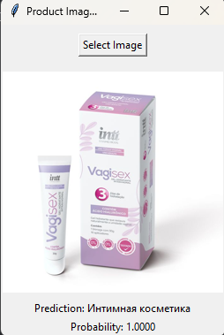
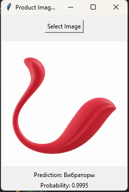
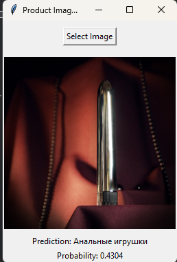

[](https://classroom.github.com/a/L5pLW1sm)
# lab-template

1. нужна была разметка. закинул в гпт попросил сделать gui для разметки фоток + скачивалку с моего апи фоток, подкрутил описания и названия для лучшего определения


Датасет содержит:
Всего изображений: 7490

Распределение по категориям ДО:


после реорганизации:


сама модель состоит из:

+ 2 линейных слоя по 1024 и 512 нейронов
+ слой нормализации
+ слой активации
+ слой регуляризации
 
(х2 все)

есть балансировка данных по скольку изначально классы совсем несбалансированы, я сначала объединил по схожим категориям, а потом еще и отбалансил их

плюс ко всему добавил раннюю остановку процесса обучения, чтобы не было переобучения (масло масляное)

в целом архитектура очень похожа на стандартную resnet с переносом обучения 

немного метрик с обучения (это долгий процесс)
``` 
2025-02-19 04:48:50,189 - INFO - Epoch 8/50:
2025-02-19 04:48:50,189 - INFO - Train Loss: 0.3475, Train Acc: 89.20%
2025-02-19 04:48:50,189 - INFO - Val Loss: 0.6111, Val Acc: 81.87%
2025-02-19 04:49:23,306 - ERROR - Error loading image dataset\raw_images\12665\0.jpg: image file is truncated (2 bytes not processed)
2025-02-19 04:49:26,875 - ERROR - Error loading image dataset\raw_images\12665\0.jpg: image file is truncated (2 bytes not processed)
2025-02-19 04:50:46,144 - INFO - Epoch 9/50:
2025-02-19 04:50:46,144 - INFO - Train Loss: 0.2918, Train Acc: 90.54%
2025-02-19 04:50:46,144 - INFO - Val Loss: 0.5473, Val Acc: 84.80%
```


ну и пример gui с предиктом на фотки, которые модель не видела






p.s. если успею завтра дообучаю, а то сейчас уже 5 утра.
